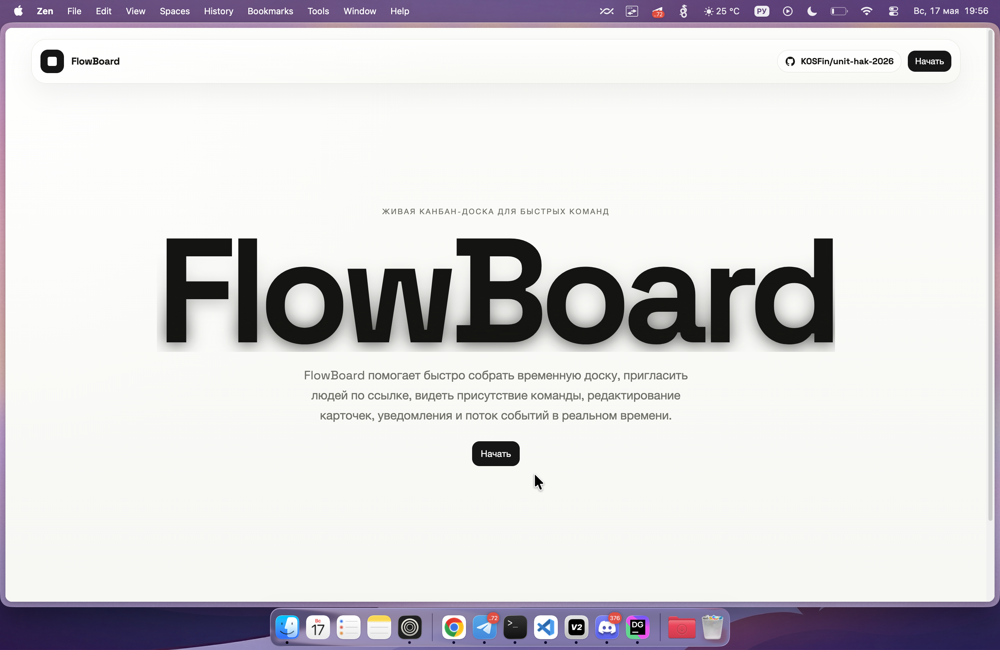
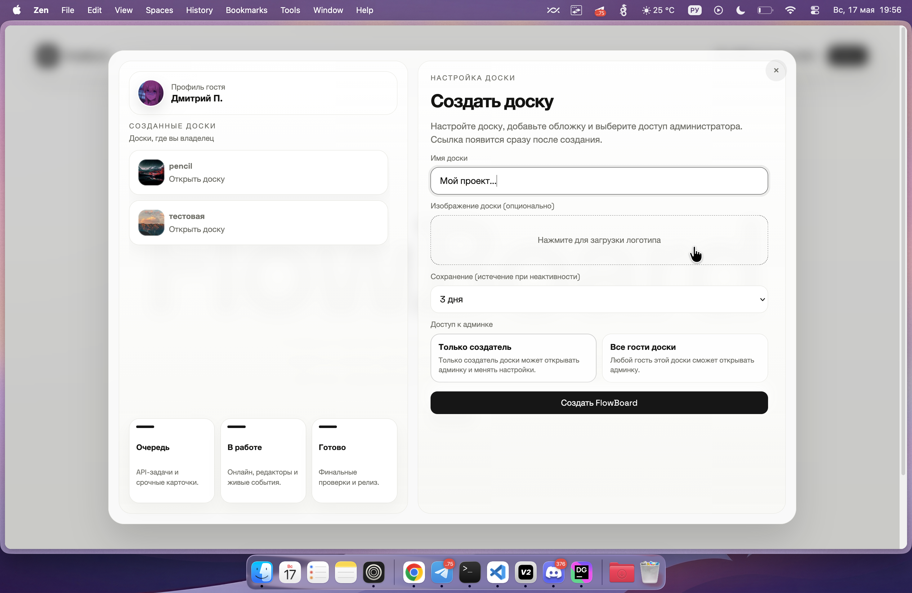
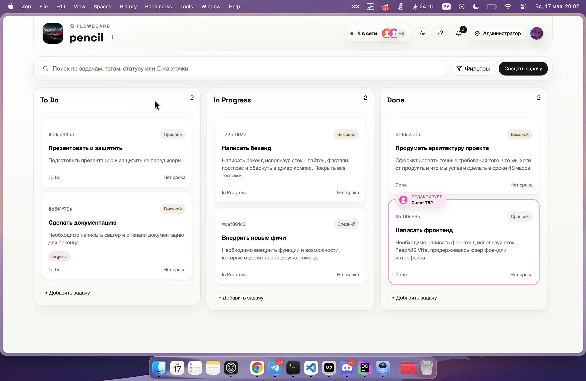
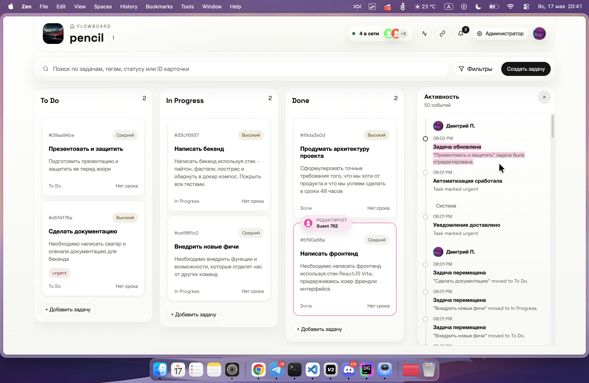

# unit-hak-2026

FlowBoard - это канбан-система для управления задачами в реальном времени, собранная в формате event-driven продукта уровня Jira/Trello. Проект объединяет публичные доски, гостевой доступ, автоматизацию по правилам, очередь входящих задач, уведомления и realtime-синхронизацию между пользователями.

## Технологии


## Видео

<video src="./Docs/media/main-video-cover-for-redme.mov" controls width="100%"></video>

[Открыть видео напрямую](./Docs/media/main-video-cover-for-redme.mov)

## Ссылки

Демо: [https://unit2026.ruka.me](https://unit2026.ruka.me)  
Созданная доска на демо (без админ-доступа): [https://unit2026.ruka.me/board/Iljyy9cIHIUCpceU](https://unit2026.ruka.me/board/Iljyy9cIHIUCpceU)  
Swagger: [https://api-unit2026.ruka.me/api/docs](https://api-unit2026.ruka.me/api/docs)  
ReDoc: [https://api-unit2026.ruka.me/api/redoc](https://api-unit2026.ruka.me/api/redoc)  
OpenAPI JSON: [https://api-unit2026.ruka.me/api/openapi.json](https://api-unit2026.ruka.me/api/openapi.json)

## О проекте

Проект сделан как полноценная хакатонная система для управления задачами, где доска живёт в реальном времени и реагирует на события без ручных обновлений страницы. Пользователь может создавать и редактировать задачи, перемещать их между колонками, видеть уведомления, работать с входящими задачами и следить за активностью на доске. Для гостей предусмотрен удобный публичный доступ по ссылке, а для организаторов и администраторов - управление правилами автоматизации, колонками и потоком задач.

Внутри система построена как набор связанных контуров: REST API фиксирует изменения, доменные события сохраняются в БД и отправляются в RabbitMQ, worker обрабатывает очередь и применяет автоматизацию, а WebSocket-канал раздаёт presence-состояние и realtime-обновления всем подключенным пользователям. Для конкурентных изменений используется optimistic locking через `version`, а входящие задачи проходят валидацию, дедупликацию и обогащение перед превращением в полноценные карточки.

## Архитектура

Frontend собран на React 19 и Vite. Он отвечает за лендинг, страницу доски, модальные окна, drag-and-drop, фильтрацию задач, уведомления, панель администратора и синхронизацию между вкладками. Интерфейс общается с backend через Axios и держит realtime-соединение через WebSocket, автоматически переключаясь между `/ws` и `/api/ws`.

Backend построен на FastAPI, SQLAlchemy и Alembic. Здесь лежат маршруты для досок, колонок, задач, уведомлений, правил автоматизации, входящих задач, загрузки изображений и realtime-reference. Слой сервисов инкапсулирует бизнес-логику, репозитории работают с БД, а отдельный event layer пишет доменные события и публикует их в RabbitMQ.

Worker забирает сообщения из очереди и выполняет прикладные сценарии: проверку входящих задач, создание карточек, запуск правил автоматизации, генерацию уведомлений и фиксацию событий. Это позволяет держать систему ближе к event-driven модели и не терять важные действия при пиковых нагрузках.

## Соответствие ТЗ

Система покрывает ключевые пункты хакатона: есть канбан-доска с базовыми и кастомными колонками, карточки с приоритетом, тегами, дедлайном и метаданными, real-time синхронизация, события создания/обновления/перемещения/удаления, очередь входящих задач, автоматизация по правилам и пользовательские уведомления. Отдельно реализованы механики надёжности: health/readiness checks, дедупликация входящих задач, валидация payload-ов, сохранение доменных событий и контроль конфликтов при редактировании.

## Запуск через Docker Compose

Проще всего поднимать проект через Docker Compose. Перед стартом скопируйте `.env.example` в `.env` и при необходимости подправьте адреса, секреты и публичные URL.

```bash
cp .env.example .env
docker compose up -d --build
```

После запуска фронтенд будет доступен через опубликованный веб-адрес, а backend - через `BACKEND_PUBLIC_URL`/внутренний порт из compose. Миграции применяются автоматически при старте `backend-api`, а демо-данные можно включать через `SEED_DEMO_DATA=true`.

Для локальной разработки особенно важны переменные `DATABASE_URL`, `RABBITMQ_URL`, `VITE_API_BASE_URL`, `VITE_WS_URL` и `PUBLIC_BOARD_URL_BASE`. В compose они берутся из `.env`, поэтому достаточно один раз настроить окружение, а дальше запускать контейнеры одной командой.

## Что внутри по сервисам

Backend поднимает PostgreSQL, RabbitMQ, API, worker и статический доступ к `uploads`. Frontend отдаётся через Nginx и сам умеет проксировать `/uploads` и `/app/uploads` к backend. Такой расклад удобен для демо и для продакшн-подобного стенда, потому что отдельно видны слой данных, очередь, API и клиент.

## Скриншоты









## Команда

Сделано командой Pencil <3
